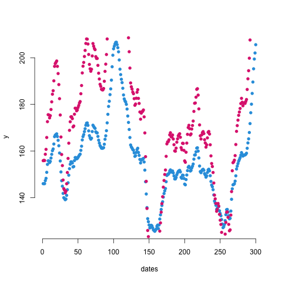
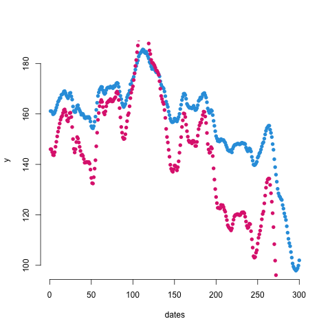
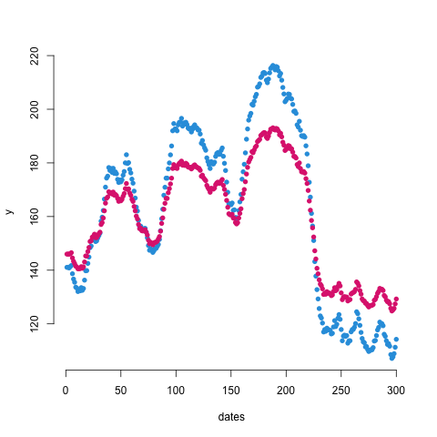
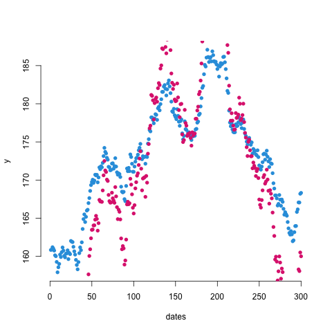
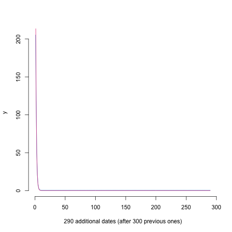
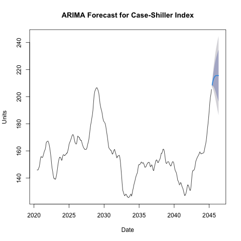

<p  style="font-size: 12px;">
Authors: Elvin Jamalzade, Alersan Paker
<br/>
Leading Professor: Maciej Świtała
<br/>
Faculty of Economic Sciences
<br/>
University of Warsaw Time Series Analysis, Spring 2021
</p>

# Home Project Report

## 1. Scope, Aim and Objective of study

<p style="font-size: 15px;">Scope of study is to perform time series analysis in a certain set of data. This process involves running statistical test in order to arrive at conclusions backed up by empirical evidences. As the aim of the study we can refer to presented set of data. It involves time series of ten financial instruments which we need to compare forecasted prices accuracies.
The objective is to find one pair of cointegrated financial instruments running statistical tests and after that estimating future prices using following models:
1. VECM/VAR model
2. ARIMA model
</p>

<p style="font-size: 15px;">
The first step of the project is focused on confirmation of non–stationarity of time series. And we found out following cointegrated pairs:

stock 1 and stock 5;
stock 2 and stock 3;
stock 4 and stock 10;
stock 6 and stock 9.
</p>


And also we built chart for them in order to see the correlations between cointegrated pairs.

#### 1. stock 1 and stock 5


#### 2. stock 2 and stock 3


<br/>

#### 3. stock 4 and stock 10


#### 4. stock 6 and stock 9


## 2. VAR Model

<p style="font-size: 15px;">Afterwards, we took one pair of the financial instruments that we assume (stock 1 and stock 5) that have a higher chance of being cointegrated and we can continue with data diagnostics with this pair. Subsequently, we perform cointegration test and as a result we can confirm that stock4 and stock 10 are cointegrated.</p>


<p style="font-size: 15px;">When it comes to the forecast part with VAR, we deployed the predict command, where we can forecast 10 steps ahead. As a result, we have predictions of stock4 and stock10 for the 10 days.</p>

<p style="font-size: 15px;">Looking at сorrelation matrix of residuals in the result:</p>

```bash
Correlation matrix of residuals:
       y1     y5
y1 1.0000 0.9997
y5 0.9997 1.0000
```

<p style="font-size: 15px;">we can see that `y1` and `y5` correlate with coefficient `0.9997`, which is very close to `1`. That also proves that stock 1 and stock 5 are cointegrated.</p>

<p style="font-size: 15px;">Also by VAR Estimation Results:</p>

```bash
Estimation results for equation y1: 
=================================== 
y1 = y1.l1 + y5.l1 + const 

      Estimate Std. Error t value Pr(>|t|)
y1.l1  -0.1589     2.4242  -0.066    0.948
y5.l1   0.5827     1.2120   0.481    0.631
const  78.4369   164.8674   0.476    0.635

----------------------------------------------------

Estimation results for equation y5: 
=================================== 
y5 = y1.l1 + y5.l1 + const 

      Estimate Std. Error t value Pr(>|t|)
y1.l1  -0.2807     4.8496  -0.058    0.954
y5.l1   1.1468     2.4246   0.473    0.637
const  18.3431   329.8205   0.056    0.956
``` 

<p style="font-size: 15px;">we can draw by formulas</p>

```
y1(t) = y1.l1 * y1(t-1) + y5.l1 * y2(t-1) + const
y2(t) = y1.l1 * y1(t-1) + y5.l1 * y2(t-1) + const
```

<p style="font-size: 15px;">corresponding VAR charts:</p>



<p style="font-size: 15px;">So, we can see that two stocks almost identical in forecast.</p>

## 3. ARIMA Model

<p style="font-size: 15px;">After building our bi-variate VAR model we progressed into building our ARIMA model for stock 1 and stock 5.</p>

### 1. stock 1 



### 2. stock 5


<p style="font-size: 15px;">As we can see, in both charts the direction of forecast is going upwards.</p>

## 4. Results
<p style="font-size: 15px;">Comparing the forecasts accuracy measure for both VAR and ARIMA we evaluated that our forecasts were pretty accurate with MAPE (mean absolute percentage error) and aMAPE (average mean absolute percentage error) close to 0. MAPE and aMAPE are the most intuitive values to consider when evaluating forecasts accuracy.</p>
